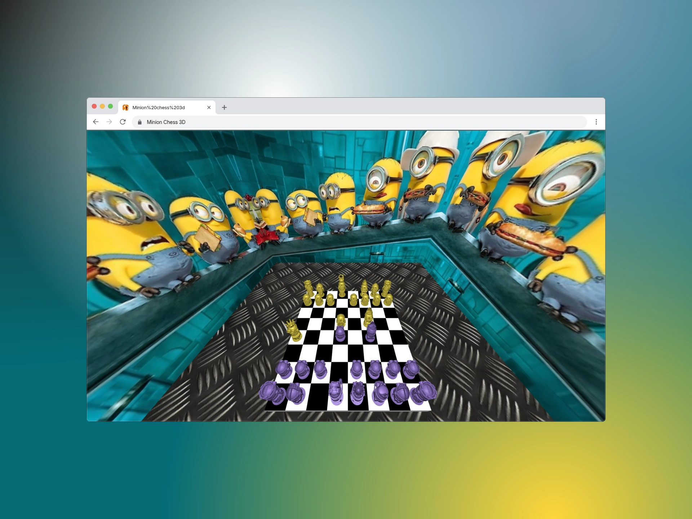

# 3D Chess - Minion Edition

¡Bienvenido a **3D Chess - Minion Edition**!  
Este proyecto es una versión interactiva y divertida del ajedrez clásico, inspirada en el universo de los Minions y desarrollada en 3D utilizando la poderosa librería **Three.js**.



## Descripción

**3D Chess - Minion Edition** es un juego de ajedrez tridimensional que combina la lógica tradicional del ajedrez con una experiencia visual inmersiva y personajes temáticos. El tablero y las piezas han sido modelados y renderizados en 3D, permitiendo a los jugadores disfrutar de una perspectiva única y animaciones atractivas.

## Características principales

- **Visualización 3D**: Gracias a **Three.js**, el tablero y las piezas cobran vida en un entorno tridimensional completamente interactivo.
- **Temática Minion**: Todas las piezas y escenarios están inspirados en los famosos personajes de los Minions, aportando un toque divertido y original.
- **Interfaz intuitiva**: Controles sencillos y una interfaz amigable para que cualquier usuario pueda disfrutar del juego.
- **Efectos visuales y sonoros**: Animaciones y sonidos personalizados para una experiencia envolvente.

## Tecnologías utilizadas

- [Three.js](https://threejs.org/): Motor principal para la creación y renderizado de gráficos 3D en el navegador.
- HTML5, CSS3 y JavaScript: Para la estructura, estilos y lógica del juego.
- Bootstrap: Para el diseño responsivo de la interfaz.

## Instalación y uso

1. Clona este repositorio:
   ```bash
   git clone https://github.com/jbarrera094/3D_Chess.git
   ```
2. Abre el archivo `Index.html` en tu navegador favorito.
3. ¡Disfruta del ajedrez 3D con Minions!

## Créditos

Este proyecto fue desarrollado como un trabajo en equipo por los siguientes miembros:

- **Andres Posada Saldarriaga**
- **Jhon Jairo Bonilla**
- **Jeisson Harvey Barrera**

## Licencia

Este proyecto es de código abierto y se distribuye bajo la licencia MIT.
